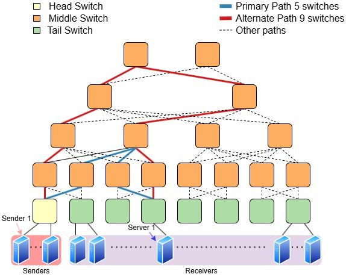

# Software Tree Topology with OMINE

In this project, we implement the tree topology described in the paper, as shown in the following figure. For the experiment results collected in the paper, due to memory and computation constraints, we used a 14-node sampled subtree that maintains the same primary and alternate paths as the full topology. This subtree maintains the same primary and alternate paths and is used to evaluate the flexibility and scalability of OMINE using the code in this folder.



This directory is organized as follows:
```sh
mechansim/
 |-- figures/        # contains the tree topo figure
 |-- mininet/        # contains code to construct both the full tree topology and a subtree topology
 |-- onos/           # contains the onos code to load pipelines and install CLONE group into the switch
 |-- p4/             # contains the P4 programs of OMINE
 |-- spatial/        # contains an example Spatial program
 |-- traffic/        # contains python scripts to send and recv packets and the associated input files for creating traffic
 |-- ...
```

> **Note:** 
> All the commands in this folder assume your `$PWD` is under this current directory i.e. `$projectRoot/software/tree/mechanism/`.

## MapReduce BM dockers

Since the Platform BM dockers have been explained and started in the parent directory, you can verify whether they are running using the following command::
```sh
docker ps
```

## Start the ONOS, Mininet, and MapReduce Apps

A `Makefile` is provided, which automates the process of running Mininet, Stratum switches with P4 code, ONOS, MapReduce modules, and other required configurations. The `Makefile` commands rely on Docker and the scripts in the `../scripts` folder. For more details, explore those scripts directly.


The following describes the steps to reproduce our experiments using the sub-tree topology: 
### a. Starting ONOS
In a first shell, start ONOS:

```sh
make onos-start
```

This will start the ONOS controller. You will see a lot of information printed on the terminal; wait until it stops -- and it will stop!

> **Note:**
> This command will also start the ONOS Web GUI for you to see more information about your topology after you load the P4 pipelines with ONOS. For more information please check [ONOS Web GUI](https://wiki.onosproject.org/display/ONOS/The+ONOS+Web+GUI)

### b. Starting Mininet
In a second terminal, **start Mininet**:

```sh
make mininet-start-experiment
```

Once started, you will see the `mininet>` prompt. This indicates that your virtual network is ready and running, and you can now issue mininet commands through this prompt.

> **Note:** 
> Alternatively, you can also run the full tree topology by running `make mininet-start-tree`.

### c. Building the P4 program and ONOS application

Before connecting switches to the ONOS controller, we need to build the P4 program and the associated ONOS application, and load these into ONOS. To do so, run these steps in a separate terminal.

* Build all P4 program (i.e. s1, s2 etc).
* The command uses the p4-build-all.sh in ['../scripts'], based on the number of switches specified in the top of the Makefile
```sh

make p4-build-all
```

> **Note:** you can delete the compiled output using `make p4-clean`.

This will compile the P4 program with the number of switch nodes specified in the beginning of the `Makefile`, i.e. `export NUM_SWITCHES ?= 14` (You can modify this value to support any number of P4 Programs), and store its output into the ONOS application's [resources](onos/app/src/main/resources) folder.

* Next, compile the ONOS application.

```sh
make onos-build-app
```

> **Note:** you can delete the compiled output using `make onos-clean-app`.
> 
* Finally, load the application into ONOS and connect it with all the switches.

```sh
make onos-reload-app
make onos-netcfg
```

* Note: # Since there are many switches, wait a couple of seconds for the ONOS to activate the pipeline before running the second command.


### d. Building and running the Spatial application

Next, we will be build our anomaly-detection Spatial application [`Kernel.scala`](spatial/Kernel.scala), located in the `spatial` folder.

In this folder, we have given an example of how the structure 


You need to fetch the MapReduce model you need under `$projectRoot/` and place it into the `spatial` folder using the following structure in order for the Makefile commands to operate correctly. 

For each of the model, create the following structure and run the following: 

 > **Note:** X in the following section is the associated switch number, e.g., mapreduce connected to switch 1 run `mapreduce-build-app1-rc`, etc.
 > Due to the high memory consumption of building MapReduce BM and the high CPU usage of hardware simulation, you would probably build and run the associated MapReduce BMs along your packet path, i.e. if your packet traverse through 5 hops in the tree `h1->s11->s8->s6->s9->s14->h4`, you only need to build and run MapReduce11, MapReduce18, MapReduce6, MapReduce9, MapReduce14.

```sh
spatial
 |-- spatial1
     |--params/                 # copy the parameters of the MapReduce models into the params/ folder 
     |--Kernel.scala            # Scala code for the MapReduce pipeline
 |-- spatial2
     |--params/
     |--Kernel.scala
 |-- ...
 |-- spatialX
     |--params/
     |--Kernel.scala
```

```sh
cd ~/tree/mechanism/
make mapreduce-build-appX-rc 
```

Once the build completes, run the Spatial application.

```sh
cd ~/tree/mechanism/
make mapreduce-run-appX
```

This will start the MapReduce BM docker for the corresponding switch.

### e. Enabling traffic via MapReduce BM

In the topology above, we have specified two paths: a 5-hop path (marked in red) and an 9-hop path (marked in green)

To route traffic through MapReduce BM through the 5-hop path, run the following command from a separate terminal.
```sh
make onos-traverse-mapreduce-sw5-path1
```
Alternatively, to route traffice through the 9-hop path, you can run the following command:
```sh
make onos-traverse-mapreduce-sw9-path1
```

This will install the necessary P4 rules in the switch to traverse traffic through MapReduce BM accordingly.

> **Notes:**
> - The status `201` indicates that a rule has been successfully installed.


### f. Sending traffic from host `h1` to `h2`/`h3`/`h4`.

Open two separate terminals for sending and receiving  packets from `h1` and `h4`, respectively. We provide two ways to receive and parse packets with 5-hops and 9-hops respectively. For other hops number of hops and other receiving hosts, check `traffic/h2-recv.py`. 


For 5-hops:
```sh
make h4-recv-sw5
```
For 9-hops:
```sh
make h4-recv-sw9
```

This starts a Scapy receiver, which will receive packets and compute/print the various ML metrics (e.g., F1 score and accuracy). In addition, the receiver would also help you verify majority voting logic for the final classification. Since the output can be very long, you may wish to write output to a file for easier analysis.

To send packet using `h1`, run:

```sh
make h1-send
```

This will use CICIDS data to construct and send packets (located in [`traffic/batched_cicids_5000_test.csv`](traffic/batched_cicids_5000_test.csv)) from host `h1` using scapy.
In addition, since there are multiple MapReduce modules being simulated. MapReduce modules process packets in a batched pipeline, we lowered the sending rate in `h1-send.py`, you can experiment with different batch size in the `Makefile` and different sending rate in `h1-send.py`.

> **Notes:** To send different inputs, i.e. unsw 5000 packets, modify the input file in `h1-send.py` to be `batched_unsw_5000_test.csv`.

The packet will go through each MapReduce BMs (as can be seen from the output on the terminal running MapReduce). 

Please wait patiently for all packets to be transmitted. This will take from minutes to hours depending on your input size, the amount of nodes your packets traverse through, and your batch size specified in `Makefile`.

### g. Cleaning up ...

Stop ONOS and the running MapReduce BMs by pressing `CTRL+C`, and Mininet by typing `exit`. 

If everything works out, Congratulations! You have finished rerunning the very first experiment with the tree topology. ;P


## Relocating, Extending and Modifying the P4 programs for different placements / different topology

This subsection gives information about the placement of P4 program if the topology needs to be modified. If you are just trying to re-run the experiments, you can safely skip this part. 

The organization of the `p4` folder is as follows:
```sh
p4/
 |-- include
    |-- final_switch                # contains header, parser, and output_comput needed on final switch
    |-- first_switch                # contains header and parser for first switch
    |-- middle_switch               # contains header and parser of differet layers in the tree for middle switches
    |-- ...                         # common header files
 |-- s1/                            # contains main.p4 for s1
 |-- ...                            # one or multiple p4 folders
 |-- final_switch_processing.p4     # code for the final_switch
 |-- first_switch_processing.p4     # code for the first_switch
 |-- middle_switch_processing.p4    # code for middle_switches
```
Since OMINE's majority voting mechanism involves three types of switches: first switch, middle switches, and final_switch. Any packet path constructed must include one first switch, X number of middle switches, and a final switch. To modify placement of a switch, i.e change `s1` from middle_switch to a first_switch, you just need to place the content of `first_switch_processing.p4` in the associated folder of `s1` in `main.p4`, and change line 94 of the `ingress_port` in `first_switch_parser.p4` to map to the ingress port from the MapReduce module, e.g. if the ingress from MapReduce is 4, then line 94 should be `4: parse_output`.

The same logic applies to other placement for middle and final switches to correctly parse the input packet from the MapReduce module. 

Have fun! & Feel free to reach out if you have any questions ;P
